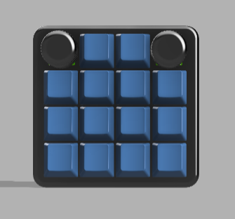
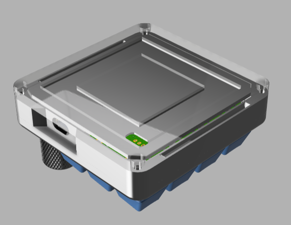
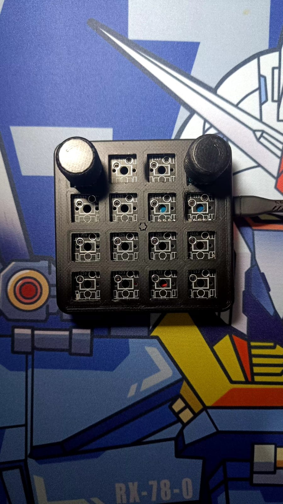
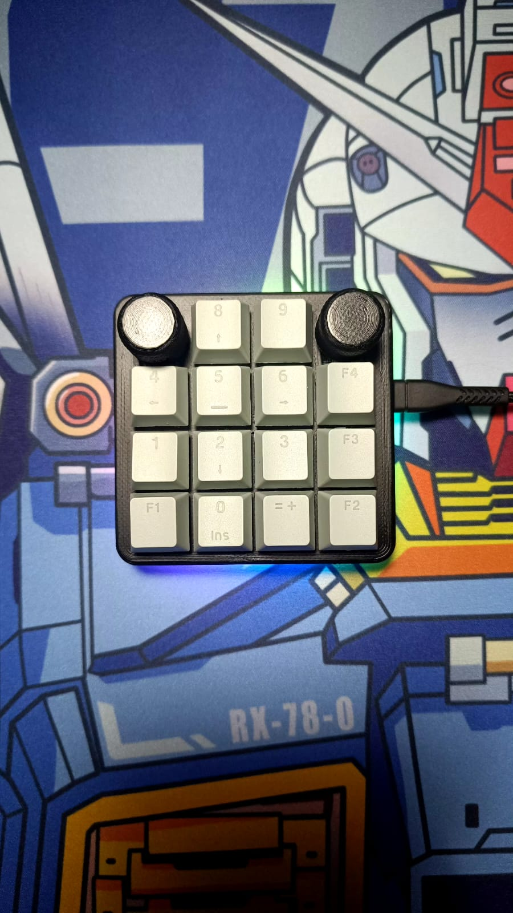

# ZEAPAD-QMK-VIA

## Spesification
- STM32F401 as Microcontroller
- QMK Firmware
- Support VIA, all key and knob can proggrammed
- RGB Underglow
- 4x Layer 
- 16x Switch or 15x Switch + 1 Encoder or 14x Switch + 2 Encoder
- Hotswap Switch
- 3D Case 
- USB type C

## Download VIA
Link Download VIA(Pilih sesuai OS) : https://github.com/the-via/releases/releases
VIA WEB VERSION : https://usevia.app/

## Autodetect on VIA or you can load JSON File
- Connect your macropad to PC
- Open VIA
- In Tab Setting, enable "Show Design Tab"
- Open Design Tab
- Load file with name "zeapad_via_definitions.json" 
- Open Configure Tab to setting your macropad
- If nothing happend , do it again from first

## Preview Hardware

  
  
  
  
  
  

## Preview VIA

