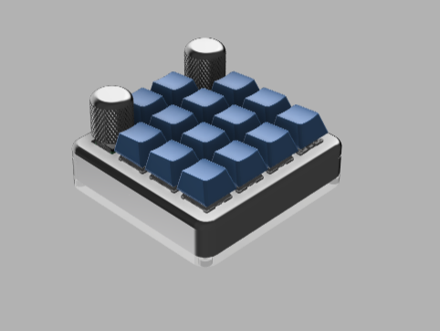

# ZEAPAD-QMK-VIA

## Spesification
- STM32F401 as Microcontroller
- QMK Firmware
- Support VIA, all key and knob can proggrammed
- RGB Underglow
- 4x Layer 
- 16x Switch or 15x Switch + 1 Encoder or 14x Switch + 2 Encoder
- Hotswap Switch
- 3D Case 
- USB type C

## Download VIA
Link Download VIA(Pilih sesuai OS) : https://github.com/the-via/releases/releases
VIA WEB VERSION : https://usevia.app/

## Autodetect on VIA or you can load JSON File
- Connect your macropad to PC
- Open VIA
- In Tab Setting, enable "Show Design Tab"
- Open Design Tab
- Load file with name "zeapad_via_definitions.json" 
- Open Configure Tab to setting your macropad
- If nothing happend , do it again from first

## Preview Hardware

  
  
  
  
  
  

## Preview VIA

## Cara Update/Upgrade Firmware
- Siapkan dahulu macropad, kabel usb dan firmware yang ingin di update/upgrade ke macropad anda
- Siapkan Firmware yang akan digunakan untuk update/upgrade
- Download Software QMK Toolbox di [link berikut](https://github.com/qmk/qmk_toolbox/releases)
- Install Software QMK Toolbox, Install Semua drivernya. setelah siap anda dapat meload Firmware yang seblumnya. Lalu Centang Auto-Flash seperti gambar dibawah

  

- Colok kabel ujung usb type C ke macropad tanpa mencolokannya dahulu ke USB PC anda
- Tekan dan tahan tombol yang berada di ujung atas kiri. lalu colokan Ujung USB yang sebelum ke USB PC anda sambil tetap menahan tombol sebelum nya sebentar
- Setelah ada bunyi/notif USB masuk. anda dapat melepaskan tombol knobnya
- Maka secara otomatis macropad akan terflash. jika selesai maka tampilan QMK toolbox akan seperti gambar dibawah

  

